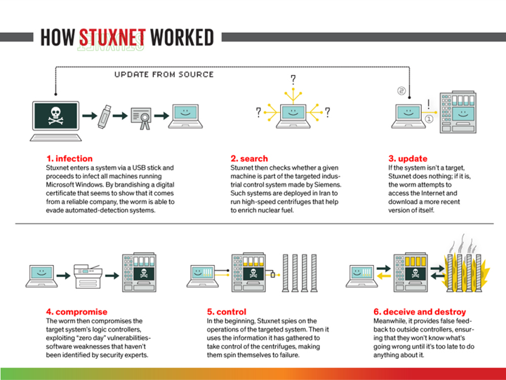
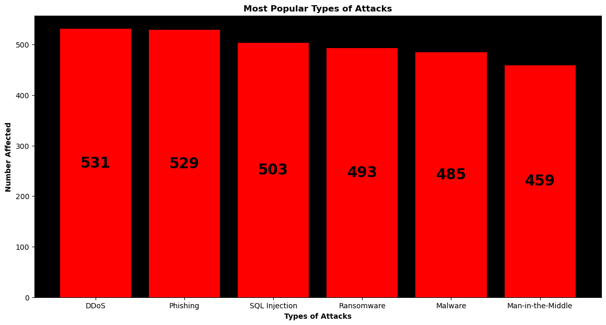

# Midterm-Project
Midterm Project (Cybersecurity Attacks Presentation)
Cybersecurity Data Midterm

Overview:
Powerpoint presentation of Cybersecurity Data Questions based off of Global_Cybersecurity_Threats_2015-2024.csv

Research Questions:
See Cybersecurity Data Questions.txt

Source of Data:
Global_Cybersecurity_Threats_2015-2024.csv

Table of Contents
- Code 
- Powerpoint Presentation
- Template
- Questions
- Images
- Global_Cybersecurity_Threats_2015-2024.csv

How I cleaned and transformed data.
- Used Pandas
- Using the template created (Cybersecurity Data Template.txt) I was able to calculate columns to create bar and pie charts.

Contextual visualization(s)
    What visualizations do we need to understand your topic?:
    
    
    

Objective specific visualization(s)
    What visualizations display your results
    
    
    
    
    
        
    
    
    
    

Key Insights:
    - It's important to keep presentations short and sweet with minimal wording.
    - While information on my inital powerpoint was good; it was a bit too much and unfortunately made the messaging unclear.

Tell us what future areas you might want/need to study:
    Future cyber attacks; especially with AI and potentially Quantum Computing
    Ask the question of: How does AI change the dynamics of Cybersecurity?

How to contribute to the project (optional)
    Send data on Cyberattacks that happen anywhere in the world.
    Either Case Studies or incidents that are currently happening.